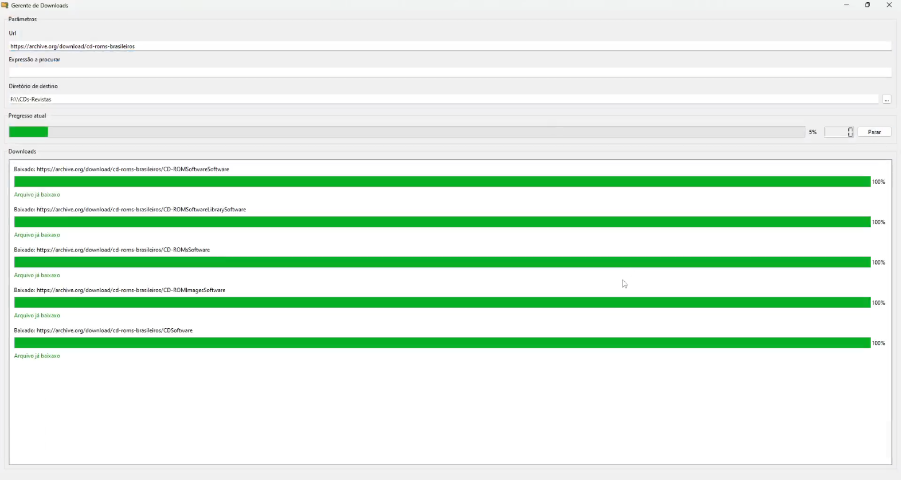

# GT-GPT4

Utility that reads a specific fixed website and searches for urls that follow a pattern and downloads the associated files in parallel with a maximum of 5 parallel downloads.

## What's done:

- Search on specific URL
- Parallel downloads limited to 5 at a time
- Possibility to restore corrupted files in case of failures

## What remains to be finished:

- Accept any search pattern using regex

## Challenges:

- Compatibility with Windows 7